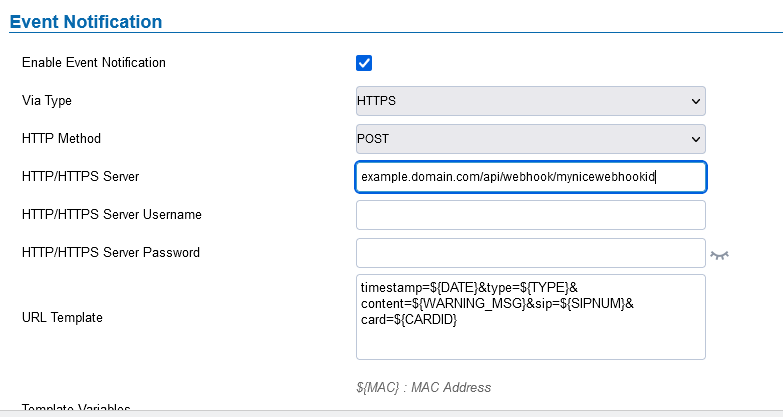

# hass-appdaemon
This is a repo for my Home Assistant Appdaemon Python code.
I don't use many automations in the Home Assistant Frontend. 99% of my automations are in Appdaemon (due to the complexity).
All of these are under active development and experimentation.

Areas covered are Grandstream SIP Doorphone, CCTV, House Mode, Garage, Calendar, Kitchen, Mobile App Events and Car (using Fordpass).

App Descriptions:


## Doorphone

This app interfaces with a Grandstream GDS3710 SIP Doorphone. Home Assistant receives events from the doorphone via webhooks, This creates a sensor, which can then be monitored. Each event passed from the doorphone carrys an identifier number, for example: 500 for doorbell or 900 for motion detected (using the internal motion detector). The Appdaemon app will action the events and can then grab pictures (from the camera), send messages etc. The doorphone also allows the use of RFID cards to perform various tasks. In this case I can use one to open the garage door.

Example configuration for webhook in Home Assistant configuration.yaml:

```
template:
# example.domain.com/api/webhook/mynicewebhookid
  - trigger: # Doophone.
      - platform: webhook
        webhook_id: mynicewebhookid
    sensor:
      - name: "Doorphone Event Timestamp"
        state: "{{ trigger.data.timestamp }}"
      - name: "Doorphone Event Type"
        state: "{{ trigger.data.type }}"
      - name: "Doorphone Content"
        state: "{{ trigger.data.content }}"
      - name: "Doorphone SIP Number"
        state: "{{ trigger.data.sip }}"
      - name: "Doorphone Card Number"
        state: "{{ trigger.data.card }}"
```

The configuration on the Grandstream looks like this:




## CCTV

This listens to a Frigate installation via MQTT and decodes the data it receives to be able to extract labels, event IDs, zones and objects.

The app utilises an input_boolean in Home Assistant, which can turn off alerts for person detection. Useful for people working in the area of a camera and being flooded with alerts.


## House Mode

This controls the mode that the house is currently in. This is based around an input_select in Home Assistant, the modes are Home, Out (for a short time), Away (for a long time), Sleep, Pre-Arrival, Scheduled arrival, Just Arrived, Just Left and Pre-Departure. It will change modes when people enter or leave, or other modes timeout. It will also run automations based on the current mode.

Home Assistant configuration.yaml for the House Mode "input_select":

```
input_select:
  house_mode_l:
    name: House Mode
    options:
      - Home
      - Out
      - Away
      - Sleep
      - Pre-Arrival
      - Scheduled Arrival
      - Just Arrived
      - Just Left
      - Pre-Departure
```


## Garage

This allows control of the door and lights in the garage. The garage has an electric door, which is linked (at the moment) to a Raspberry Pi Zero, which controls the GPIO pins via MQTT. The pins control the door opening/closing button and also watch the state of a reed switch fixed to the door (to tell if the door is open or closed). Power to the door controller is controlled via mains switch for extra security. There is also controls for the lighting and a PIR sensor to watch for human activity in the garage. The door is set to close after a timer completes, if it is left open. The timer will reset if the PIR sensor detects motion. The PIR sensor will also control the lights and will also alert if there is movement in the garage and the house mode shows that there is no one home. There are also controls to open or close the after specific time periods (such as close the door in 15 minutes).


## Calendar

Calendar works with the relatively new builtin Home Assistant calendar. It can watch for specific events such as House Mode, Garage open or close, Garage power on or off or a Telegram reminder message. These can be used activate events at specific time, like if you have someone coming to do some work and you are out. So I could for example open the garage door at 9 am on a Monday and close it an hour later. The app can also query the calendar to see if a specific event is in progress.


## Kitchen

This currently controls the kettle. It will watch the the power level to reach a certain threshold. This will then start a short timer (to switch the plug off) and send a Telegram message.


## Mobile App Events

This listens to events from the Home Assistant Mobile App. Mainly events like pressing a button on a notification. This will then execute the required response through a linked app, such as calling the garage app to close the garage door.


## Car

This watches for data passed from the Ford Pass integration. It can create alerts based on alarm status, fuel level, battery status, etc. It can also activate automations based on the car's location e.g. If the car is entering the home zone, switch on the garage door power. It also can change the montoring period to/from 5 minutes (when the car is in use, or there are security events) and 4 hours (for when the car is not in use and to reduce load on the battery). There is also a counter to keep a log of refresh events as Ford limits calls to the API to 20,000 requests a month (and will disable accounts that exceed this).

